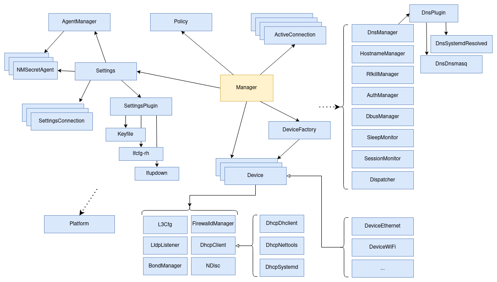

NetworkManager daemon
=====================

The following diagram describes the main components of the
NetworkManager daemon. Note that each component is in most cases a
GObject and the names always start with the "NM" prefix, which has
been omitted for clarity.

## Manager

The main responsibilities of the manager are:

- initialize all known device factories. A device factory contains the
  logic detect new devices of a certain type and create the
  corresponding object;

- maintain a list of devices created by the factories;

- maintain a list of active connections;

- expose on D-Bus properties, methods and signal on the
  `/org/freedesktop/NetworkManager`
  [object](../../introspection/org.freedesktop.NetworkManager.xml).

## Policy

This object implements some policy decisions that involve multiple
connection profiles, such as:

 - it determines what is the best (with lowest metric) active
   connection with default route for IPv4 and IPv6;

 - it updates the DNS configuration in the DNS manager, also according
   to what connection has the best default route;

 - it handles the activation of secondary connections when a
   connection goes up (see property `connection.secondaries` in
   `man nm-settings`);

 - it collects IPv6 prefix delegations from active connections, to
   distribute them on connections using IPv6 shared mode;

## Settings

This object handles connection profiles; each profile is represented
as a *SettingsConnection* object and is persisted to disk using one of
the existing *SettingsPlugin*s such as keyfile, ifcfg-rh or
ifupdown.

It also controls *SecretAgent*s; an agent is an external service that
registers to NetworkManager as capable of handling requests for new
secrets. For example, when a Wi-Fi connection is activated and the
password is missing or wrong, NetworkManager asks all registered
agents for the missing secrets and then continues with
activation. Examples of tools that register as agents are: nmcli,
nmtui, GNOME shell, the GTK nm-applet and the KDE network applet.

## Devices and device factories

As mentioned before, NetworkManager instantiates device factories to
discover and create new devices. Those factories are internal to the
daemon or provided by a device plugin; a plugin is a dynamic library
(shared object) that is loaded at runtime. NetworkManager uses plugins
for optional functionality that depend on external software. In this
way, it is possible to install a minimal version of NetworkManager
with a limited set of dependencies. As there is no stable API/ABI for
those plugins, they must be built together with the daemonq and
maintained as part of NetworkManager.

Currently the following device types are provided by plugins:

 - Wi-Fi (depends on wpa_supplicant)
 - OVS (depends on openswitch)
 - PPP (depends on pppd)
 - Bluetooth (depends on bluez)
 - team (depends on teamd)

When a device is activated, it relies on other objects:

 - *L3cfg*: controls the IP configuration (address, routes, etc) on a
    given ifindex, and also does IPv4 ACD (address conflict detection,
    also know as DAD - duplicate address detection);
 - *DhcpClient*: performs DHCPv4 and DHCPv6 on the interface; the
    object has different implementations;
 - *NDisc*: implements IPv6 SLAAC (stateless address
    autoconfiguration, RFC 4861 and 4862); it supports acting both as
    a host or a router for shared IPv6 mode;
 - *LldpListener*: when the profile enables
    [LLDP](https://en.wikipedia.org/wiki/Link_Layer_Discovery_Protocol)
    via the `connection.lldp` property, this object sets up a socket
    to listen for neighbors;
 - *FirewalldManager*: talks with [firewalld](https://firewalld.org/)
    to set the interface in the zone specified by the
    `connection.zone` property;
 - *BondManager*: used to configure bond devices in a special mode
    (balance-slb) that requires the creation of nftables rules;

For more information about the implementation of devices, see [this
document](./device.md).

## Platform

*Platform* communicates with kernel to query and update the
configuration of network interfaces; it uses netlink and implements
the crafting and parsing of netlink message by itself without relying
on external libraries such as libnl.

Platform has two subclasses, *PlatformLinux* and a *PlatformFake*. The
former is the one that contain the actual implementation while the
latter is only used for unit testing.

Note how the platform object has an incoming dotted arrow in the
diagram, to represent that the object is used by several other
objects.

As mentioned, the purposes of platform are:

 - perform operations such as adding or removing links, addresses,
   routes, routing rules and other kernel entities

 - allow querying the current state of the kernel configuration. To do
   so, platform listens to kernel notifications and parses them to
   build a cache of `NMPObject`s that is always up to date.

NMPObject and its subtypes are also used through the core to represent
information about addresses, routes, etc. Thus the cache of NMPlatform
contains the currently configured objects in the netlink API, while
other NMPObject instances are used for other tracking purposes.

For these purposes platform uses two sockets, one with protocol
NETLINK_ROUTE for regular operations about links, addresses, routes,
etc. and a NETLINK_GENERIC socket to configure Wireguard and MPTCP.

## Other objects

The diagram shows other objects on the right side:

 - *DnsManager*: merges all the DNS data received by multiple
    interfaces and updates the system configuration. Besides directly
    writing `/etc/resolv.conf`, it supports updating
    `systemd-resolved` and `dnsmasq` via plugins.
 
 - *HostnameManager*: implements reading and updating the system
    hostname; by default it tries to do that by talking to
    [systemd-hostnamed](https://www.freedesktop.org/wiki/Software/systemd/hostnamed/)
    via D-Bus; in case it's not available, the hostname manager falls
    back to reading and writing `/etc/hostname` directly.

 - *RfkillManager*: enumerates RFKill devices and controls their status. See also
    the [related page](https://networkmanager.dev/docs/rfkill/) on the website.

 - *AuthManager*: is used to authenticate the API requests received by
    the daemon. The authentication is done via
    [Polkit](https://www.freedesktop.org/software/polkit/docs/latest/polkit.8.html)
 
 - *DbusManager*: creates a connection to the system D-Bus instance
    and allows exporting objects
 
 - *SleepMonitor*: gets notifications for sleep and wake events by
    registering to the available subsystem provided by the distro such
    as systemd-logind or ConsoleKit.
    
 - *SessionMonitor*: tracks which users have an active session by
    using systemd-logind, elogind or ConsoleKit.

 - *Dispatcher*: takes care of spawning dispatcher scripts by talking
    to the `nm-dispatcher` service via D-Bus.
